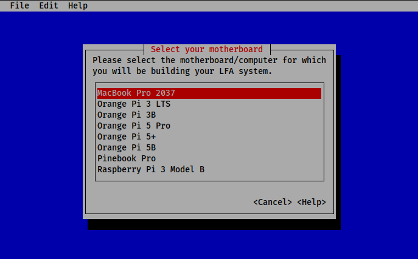

# bs



bs - автоматизированная система сборки LFA из исходного кода. Она проектировалась таким образом, чтобы быть простой в обращении: от пользователя требуется выбрать материнскую плату, для которой будет произведена кросс-компиляция LFA, при необходимости указать версию ядра и ряд других параметров. После чего выполнить несколько этапов сборки системы.

## Модель

Сборка системы производится на x86_64 компьютера посредством кросс-компилятора, генерирующего файлы для одной из архитектур семейства ARM[^1]. 

[^1]: В руководстве LFA рекомендуется собирать для AArch64, однако существует поддержка и других архитектур.

## Процесс сборки

Скомпилируйте систему сборки:

```bash
cargo b -r
```

Сначала требуется сконфигурировать систему сборки:

```bash
./target/release/bs config
```

От вас требуется указать в ряде меню нужные для сборки сведения. При необходимости можете воспользоваться справкой: она доступна по нажатию кнопки `<Help>`. В отличие от руководства LFA и документации к системе сборки эта справочная система полностью на английском.

В результате работы этой команды будет создан файл `.config.toml` с основными параметрами сборки.

После чего требуется подготовить хост-систему к сборке:

```bash
./target/release/bs configure-host
```

В результате чего будет создан пользователь и группа со случайным именем (имя пользователя и группы совпадают), а также будут создан ряд необходимых для сборки файлов и директорий в домашней директории только что созданного пользователя.

Теперь можно ыполнять сборку системы:

```bash
./target/release/bs build
```

Система сборки запоминает собранные пакеты и, если вы прервали работу `bs` до окончания сборки, вы можете вернуться к сборке с момента прерывания.

## Системные требования

- **Процессор:** 4-ядерный x86_64 процессор.
- **ОЗУ:** 4 Гб и более.
- **Свободное место:** не менее 10 Гб. Рекомендуется собирать систему на SSD.
- **Установленное ПО:** `sudo`, `rustc`, `cargo`, `ncurses`, необходимое для сборки ПО (список содержится в руководстве LFA).
